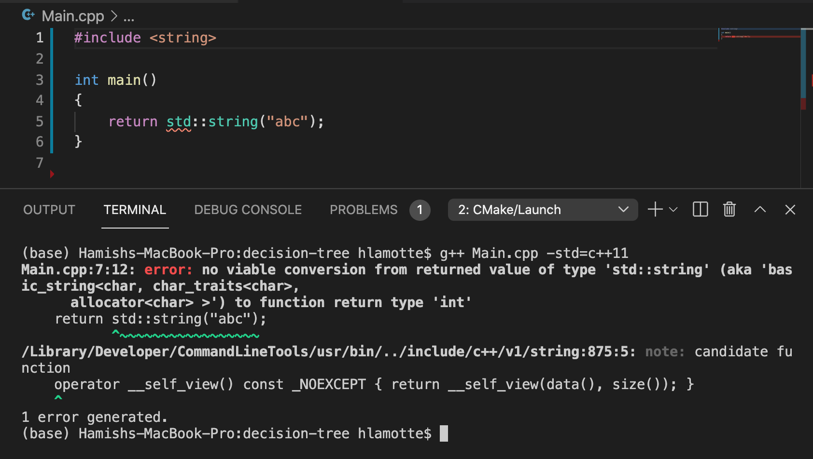
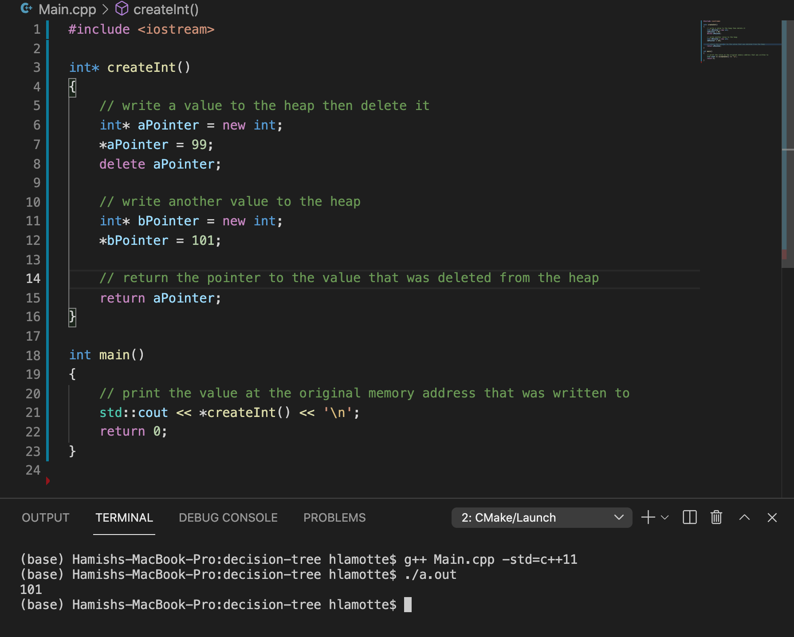
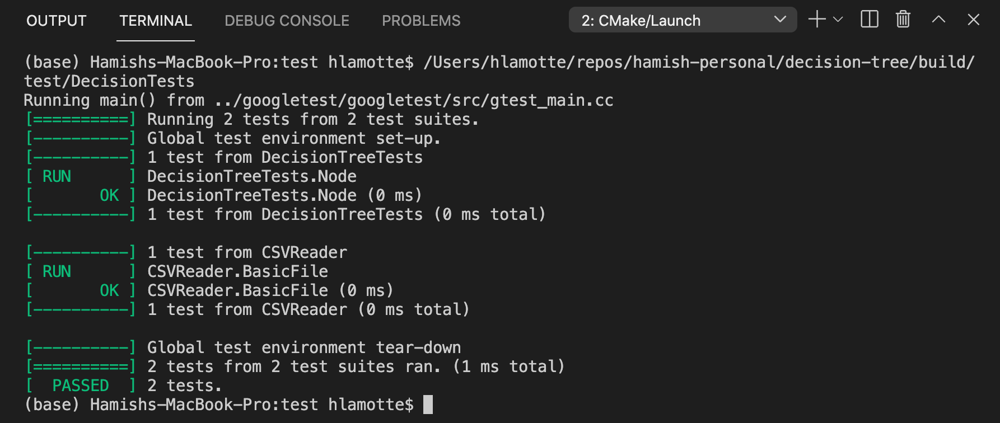
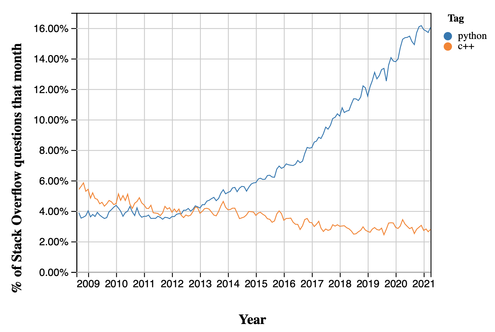

## Lessons from a Data Scientist

Python has risen to become the king of languages for data science. Most new data scientists and programmers continue to learn Python for their first language. This is for good reason; Python has a shallow learning curve, a strong community and a rich data science ecosystem of libraries.

I started my Data Science journey with Python, and it continues to be my most common tool of choice solving Data Science problems. I was interested to get a better understanding of what Python abstracts away from you and the costs vs. benefits of writing faster code in a more performant language.

In order to get a representative introduction to C++, I needed a representative application for which C++ would be an appropriate choice. Implementing a categorical decision tree classifier from scratch seemed an appropriate challenge. This has turned out to be a testing but rewarding learning journey, and I would like to share some of my main learnings along the way.

Key learnings:
1. C++ provides little guidance or protection
2. Make good architectural decisions early
3. Writing tests will save you in the long run
4. The online community of a language is worth a lot
5. Portability is an important consideration


### C++ provides little guidance or protection
You can get away with a lot in Python. You can create a variable, change its type as much as you like, and then not worry how you are going to dispose of it. This enables changing your mind about things halfway through implementing something. Great for iterative prototyping on the fly.

In C++, you have to decide what type you want your variable to be in advance. You also have to decide what type you want your functions to return in advance. And if you declare things incorrectly, for example trying to return a string from a function that has been declared to return an integer, your progress will be stopped in its tracks. In this case, the compiler will prevent you from compiling your program, usually with a convoluted error message. As frustrating as this can be, the compiler is your friend, alerting you about this problem upfront before it causes problems later down the line. It is not unusual in Python to only find problems later on when it's too late, for example after code is in production.



In the example shown above, the compiler catches a function that has been defined to return an integer trying to return a string.

There are also occasions where the compiler does not have your back. It is possible to access a variable which is thought to be stored at a specific memory address only to receive a garbage value back because that variable has already been deleted. Here you often don't receive an error at compile time, and it's easy to leave errors in your code that you remain blissfully unaware of.



In the example shown above, compilation does not give an error even though we are trying to access the value at a memory address of a variable that has already been deleted.

### Make good architectural decisions early
In Python, its easy to dive into coding a solution early on in the process of trying to solve a problem. Due to the inflexibility of C++ and the slower development pace, this approach does not work well when using C++.

I suffered in this project as a result of initially using my Pythonic approach of just writing code without mapping out a solution end-to-end. Eventually, I sat down and came up with an overarching architecture to approach the problem.

Below are listed the key objects developed in the implementation of the decision tree classifier. These include a `Node` class and a `Tree` class, along with their associated attributes and methods, and could be mostly defined before any code was written:

*Node*
- Node constructor
- Node destuctor
- Attributes
  - children nodes
  - data
  - best split feature chosen
  - best split category chosen
- Methods
  - giniImpurity() - metric for scoring quality of split
  - bestSplit() - best split feature and category

*Tree*
- Tree constructor
- Tree destructor
- Attributes
  - root node of tree
- Methods
  - traverse() - traverse nodes of tree
  - fit() - fit tree to dataset
  - predict() - make predictions classes with unseen data
  - CSVReader() - read a csv

The core files (excluding testing files) of the decision tree project are shown below for reference.

```bash
.
├── CMakeLists.txt
├── CSVReader.cpp
├── CSVReader.hpp
├── DecisionTree.cpp
├── DecisionTree.hpp
├── Main.cpp
├── Node.cpp
├── Node.hpp
└── README.md
```

Once this architecture was in place the solution followed naturally. Forward-thinking design of the interfaces of the classes and their member functions (the class and function arguments and the objects the return) can also make things even easier.

### Writing tests will save you in the long run
The lack of safety of C++ makes testing whether each part of your code is successfully completing its intended function paramount. The [Google Test](https://google.github.io/googletest/primer.html) testing framework for C++ served well for this project, building using CMake.

Writing your code in a testable manner upfront makes identifying and isolating bugs much easier. The approach was to write statically defined member functions for the classes that were implemented. A statically defined member function can be independently executed in absence of instantiation of the parent class. This enables writing specific, independent test cases for each of these functions that complete an aspect of the business logic of the decision tree.



The output of Google Test from passing tests in the terminal is shown above.

### Online community is worth a lot
Python developers have the comfort of a community of developers contributing to the collective knowledge using tools like Stack Overflow and blogs. This resource is the lifeblood of Python data science. There is no equivalent community for C++. Googling for many of the issues and error messages encountered developing C++ code often resulted in unhelpful results. The community of a language is worth a lot.



Above we can see that now more than 4x more Python related questions are being answered each month than C++. See the current status of these statistics [here](https://insights.stackoverflow.com/trends?tags=c%2B%2B%2Cpython).

### Portability is an important consideration
In Python you can be confident that any system with an installed Python interpreter will be able to execute your Python program. In C++ you no longer have this luxury. As C++ is a compiled language, you must compile your program before you can run it, and you must compile it for the architecture of the host you want to run your program on.

This became a significant issue when trying to remotely test code using Github Actions. As the host was a different OS and architecture it required compiling the code before testing it on the virtual machine. This is an extra overhead to manage when deploying code.


## Conclusion
Learning a lower-level language like C++ exposes you to many of the core concepts required for faster programs such as memory management, data structures and compiled languages. It brings awareness that the pre-implemented data structures in Python, such as Pandas DataFrames, will have systems for handling memory management which have to make a bunch of assumptions and as a result have [limitations](https://www.practicaldatascience.org/html/views_and_copies_in_pandas.html).

In practice, it is unlikely that many Data Scientists are going to be using C++ for solving experimental data science problems, but there are problems where Python is no longer the best tool, for example writing fast data parsers or implementing expensive algorithms. Even in that case, I am going to be exploring the modern lower-level languages, such as Go-lang and Rust, instead of C++. The C++ syntax feels verbose and that it lacks a lot of the safety features that you can gain from these modern languages.

You can see the full source code for the C++ decision tree classifier from scratch [here](https://github.com/hlamotte/decision-tree). You can also find an example Jupyter notebook calling the implemented decision tree classifier directly from Python and training a decision tree on the Titanic dataset [here](https://github.com/hlamotte/decision-tree/blob/main/notebooks/titanic_predictions.ipynb).
